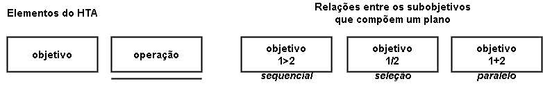

# Análise Hierárquica de Tarefas

## Introdução

A Análise Hierárquica de Tarefas (HTA) é um método de análise de tarefas que visa representar e decompor uma tarefa complexa em uma hierarquia de objetivos, subobjetivos e operações, a fim de facilitar a compreensão de como um usuário realiza uma tarefa e permitir que sejam identificados pontos problemáticos e de melhoria. A HTA é amplamente utilizada em diversos contextos, como no desenvolvimento de produtos, serviços e na melhoria de processos. Ela pode ser representada por uma tabela, ou por um diagrama, com a notação conforme a figura 1.

<figure markdown>

<b>Figura 1</b> - Notação diagrama HTA.

{width: 300}
{width: 300}

<!-- {width: 300} -->

<figcaption>Fonte: BARBOSA e SILVA, 2011</figcaption>
</figure>

## Análise de tarefa:

| Objetivos/Operações |             Problemas e recomendações            |  
|---------------------|--------------------------------------------------|
|                 | 	         | 
|              	  |  	         | 
| 	              | | 
|	              |	         | 

## Bibliografia
>BARBOSA, S. D. J.; SILVA, B. S. Interação Humano-Computador. Rio de Janeiro: Elsevier, 2011.

>Análise de tarefas. Disponível em: <<https://interacao-humano-computador.github.io/2022.2-Lichess/>>. Acesso em 06 de abril de 2023.   

## Histórico de Versão

| Versão |    Data    |                Descrição                 |                    Autor(es)                     |                 Revisor(es)                  |
| ------ | ---------- | ------------------------------------------- | ------------------------------------------------ | ------------------------------------------- |
| `1.0`  | 06/05/2023 | Criação da página de Processo de Design. | [Douglas Alves](https://github.com/dougAlvs) e [Geovanna Maciel](https://github.com/manuziny) | [Douglas Alves](https://github.com/dougAlvs) |