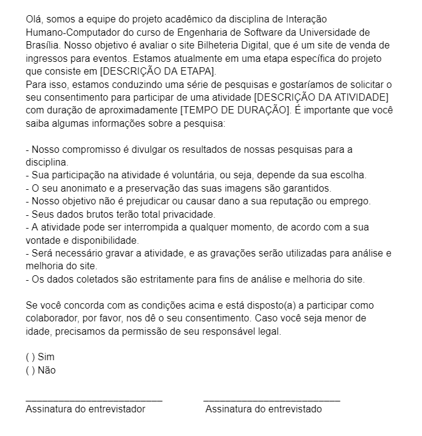

## Introdução

Uma pesquisa eticamente justificável precisa respeitar o participante da pesquisa em sua dignidade e
autonomia, reconhecendo sua vulnerabilidade, assegurando sua vontade de contribuir e permanecer, ou não, na pesquisa, por intermédio de manifestação expressa, livre e esclarecida. A ideia é garantir que o procedimento dos pesquisadores durante seus estudos resulte em reconhecimento científico baseado em princípios éticos. No Brasil, a [resolução nº 466/2012](./reso466.pdf) do Conselho Nacional de Saúde<a id="anchor_1" href="#REF1">^1^</a> rege as questões ligadas às pesquisas científicas envolvendo pessoas com base nos seguintes príncipios:

- Princípio da autonomia: envolve o consentimento livre e esclarecido dos indivíduos e a proteção de grupos vulneráveis e legalmente incapazes, como menores de idade, alunos ou subordinados. Em pesquisas envolvendo seres humanos, é importante tratá-los com dignidade, respeitá-los em sua autonomia e defendê-los em sua vulnerabilidade.
- Princípio da beneficência: requer uma ponderação cuidadosa entre riscos e benefícios, tanto presentes quanto potenciais, individuais ou coletivos. É necessário comprometer-se com o máximo de benefícios e o mínimo de danos e riscos. Esses danos podem ocorrer em várias dimensões da vida humana, como física, psíquica, moral, intelectual, social, cultural ou espiritual, tanto durante a pesquisa quanto após ela.
- Princípio da não maleficência: busca garantir que danos previsíveis relacionados à pesquisa sejam evitados, tanto imediatos quanto tardios.
- Princípio da justiça e equidade: está relacionado à relevância social da pesquisa, buscando vantagens significativas para os participantes e minimização do ônus para aqueles que são vulneráveis. É importante garantir a igual consideração dos interesses envolvidos em todas as etapas da pesquisa.

## Termo de Consentimento

Os Termos de Consentimento Livre e Esclarecido (TCLE) têm como objetivo fornecer informações detalhadas sobre uma pesquisa para as pessoas que vão participar dela. Essas informações incluem os riscos e benefícios envolvidos, de modo que as pessoas possam tomar uma decisão informada sobre se querem ou não participar. O TCLE é importante porque permite que as pessoas tomem uma decisão livre e consciente sobre sua participação na pesquisa. Além disso, em caso de uma gravação, a permissão para o uso de tal gravação, o que inclui a voz e/ou imagem da pessoal, será reforçada pelo pesquisador. Nessa disciplina, quando se trata de pesquisas envolvendo pessoas, o grupo utiliza deste template de termo de uso presente na Figura 1 quando for necessário:

**Figura 1** - Termo de Consentimento
<figure markdown>{: style="height:680px;width:650px"}

_Fonte: [Geovanna Maciel](https://github.com/manuziny), 2023_

## Referências Bibliográficas

> <a id="REF1" href="#anchor_1">1.</a> BRASIL. Resolução nº 466, de 12 de dezembro de 2012, que trata de pesquisas em seres humanos e atualiza a resolução 196. Brasília, DF: Diário Oficial da União, 2013. Disponível em: <<https://conselho.saude.gov.br/resolucoes/2012/Reso466.pdf>>. Acesso em: 06/05/2023.

## Bibliografia

> Aspectos Éticos Lichess. Disponível em: <<https://interacao-humano-computador.github.io/2022.2-Lichess/>>. Acesso em 06 de maio de 2023.

> PUC-PR. Comitê de Ética e Pesquisa – CEP. Paraná, 2017. Disponível em: <<https://www.pucpr.br/estudante/graduacao/iniciacao-cientifica/cep/>>. Acesso em: 06/05/2023.

## Histórico de Versões

| Versão | Data       | Descrição                                       | Autor(es)                                                                                     | Revisor(es)                                      |
| ------ | ---------- | ----------------------------------------------- | --------------------------------------------------------------------------------------------- | ------------------------------------------------ |
| `1.0`  | 06/05/2023 | Criação da página da página de aspectos éticos. | [Douglas Alves](https://github.com/dougAlvs) e [Arthur de Melo](https://github.com/arthurmlv) | [Matheus Henrique](https://github.com/mathonaut) |
| `1.1` | 02/07/2023 | Correções após verificação | [Geovanna Maciel](https://github.com/manuziny) | [Arthur de Melo](https://github.com/arthurmlv) e [Matheus Henrique](https://github.com/mathonaut)
