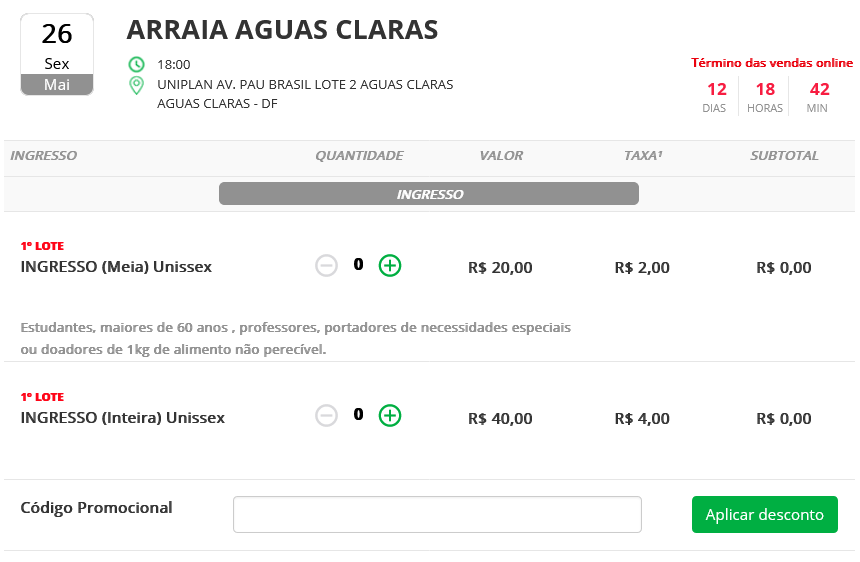
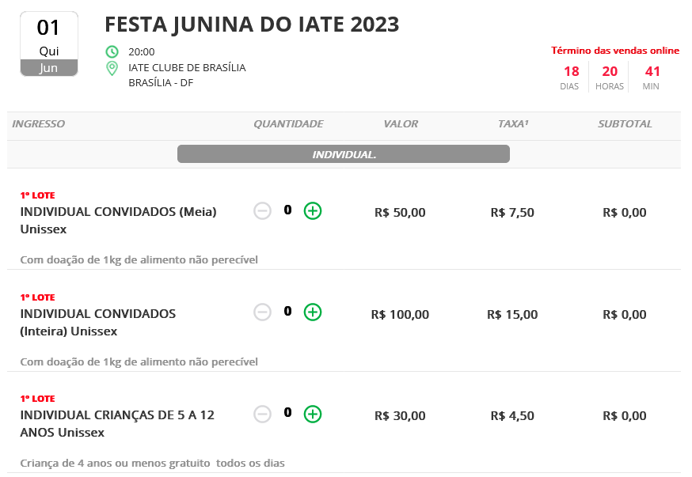

# Metas de Usabilidade

## Introdução

Podemos definir usabilidade como sendo o grau em que um produto é usado por usuários específicos para atingir objetivos específicos com eficácia, eficiência e satisfação em um contexto de uso específico.<a id="anchor_1" href="#REF1">^1^</a>

Metas de Usabilidade, portanto, seriam os fatores de qualidade que permite que as características elencadas no parágrafo anterior sejam alcançadas. As metas utilizadas neste projetos serão as seguintes: Eficácia, Eficiência, Segurança, Utilidade, Aprendizado e Memorização.<a id="anchor_1" href="#REF1">^1^</a>

## Metodologia

No contexto desse trabalho, todas as metas serão analisadas para que se possa ter uma visão ampla da usabilidade do sistema e determinar quais possuem uma implementação problemática e que deverão ser priorizadas no projeto.

Será simulado o provável comportamento dos usuários, com as características definidas pelo [perfil do usuário](../analise-de-requisitos/perfil-usuario.md), em diversas situações de uso a fim de se determinar a implementação de cada uma das metas no sistema. Sendo assim, as metas serão finalmente priorizadas, definindo quais foram atingidas pelo sistema ou não.

## Metas de Usabilidade

São enumerados a seguir as metas de usabilidade e como o sistema do site [Bilheteria Digital](https://www.bilheteriadigital.com/) as utiliza.

### 1. Eficácia

Definida como o quão bom um sistema faz o que se espera que ele faça.

#### No sistema

No geral o sistema é parcialmente eficaz, ele consegue com êxito mostrar os eventos e permite que o usuário realize com ressalvas as atividades principais de compra e visualização de ingressos.

### 2. Eficiência

Definida como o sistema auxilia o usuário a realizar as suas tarefas.

#### No sistema

O sistema não apresenta uma boa eficiência. A interface não possui ferramentas de auxílio a usuários com limitações, preenchimento de dados automático, atalhos, falta de informações sobre o estado atual dos eventos como quantidade de ingressos disponíveis e uma abertura excessiva de novas abas. Além disso, a aplicação possui uma opção de compartilhar a sua localização com o app para que sejam mostrados eventos próximos, porém após o compartilhamento, os eventos mostrados seguem sendo os da localização padrão sendo necessário uma mudança manual do usuário para que os eventos locais sejam mostrados.

### 3. Segurança

Definida como a proteção do usuário contra condições perigosas e situações indesejáveis.

#### No sistema

A aplicação possui diversas falhas nessa área. No momento da compra não se possui uma explicação clara do que seria a taxa que é aplicada sobre o valor do ingresso, por exemplo a figura 1a e 1b mostra diferentes porcentagem aplicada sobre o valor. Podemos citar ainda, as informações sobre o ingresso que são dispostas de maneira bastante confusa, o que pode fazer que o usuário tome decisões de escolha erradas.

Figura 1a - Desconto de 10% sendo aplicado.

<figure markdown>{:style="height:400px;width:550px;border-radius:5px"}<figcaption>Fonte: [Matheus Henrique](https://github.com/mathonaut) (2023).</figcaption></figure>

Figura 1b - Desconto oficial de 15% sendo aplicado.

<figure markdown>{:style="height:400px;width:550px;border-radius:5px"}<figcaption>Fonte: [Matheus Henrique](https://github.com/mathonaut) (2023).</figcaption></figure>

### 4. Utilidade

Definida como a oferta, pelo sistema, de um conjunto apropriado de funções. Ou seja, se o sistema oferece a quantidade necessária para que o usuário realize uma tarefa de maneira mais eficiente.

#### No sistema

O sistema se apresenta eficiente em relação a algumas funcionalidades principais como pesquisar um evento, comprar um ingresso, recuperar senha, cadastro/login, compartilhar um evento, localidade, visualização de pedidos, cancelamento de pedidos e alteração de cadastro, mas contendo alguns problemas na parte da Central de Ajuda, sendo em alguns casos ineficiente para seu usuário que deseja solucionar um problema ou saber mais sobre suas políticas de privacidade, ou termos de uso.

### 5. Aprendizado

Definida como a facilidade para se aprender a utilizar esse sistema.

#### No sistema

O sistema possui funcionalidades explicitas para o usuário sendo elas objetivas, evitando que o usuário precise de um longo período de treinamento.

### 6. Memorização

Definida como sendo a facilidade para um usuário se lembrar como utilizar o sistema após uma experiência prévia.

#### No sistema

A utilização do sistema se torna bastante intuitiva com a experiência de apenas alguns usuários, pois aos com alguma limitações o uso permanece limitado com o tempo devido a falta de ferramentas adequadas.

## Conclusão

As metas de [Eficiência](#met1), [Segurança](#met2), e [Utilidade](#met3) possui problemas que já foram listados anteriormente, portanto, essas metas que devem ser priorizados e tratados nas próximas etapas.

## Referências Bibliográficas

> <a id="REF1" href="#anchor_1">1.</a> BARBOSA, S. D. J.; SILVA, B. S. Interação Humano-Computador. Rio de Janeiro: Elsevier, 2011.

## Bibliografia

> PERILLO, Matheus; SANTANA, Natan Tavares. Metas de usabilidade. Repositório do Grupo Agência Virtual Neoenergia Brasília da disciplina de Interação Humano Computador da Universidade de Brasília, 2022. Disponível em: <<https://interacao-humano-computador.github.io/2022.1-AgenciaVirtualNeoenergia/analise_de_requisitos/metas_usabilidade/>>. Acesso em: 09 maio 2023.

> SANTOS, Eduardo Schuindt; VAS, João Lucas. Metas de Usabilidade. Repositório do Grupo Simples Nacional da disciplina de Interação Humano Computador da Universidade de Brasília, 2022. Disponível em: <<https://interacao-humano-computador.github.io/2022.2-SimplesNacional/Tarefas/MetasUsabilidade/>>. Acesso em: 09 maio 2023.

## Histórico de Versões

| Versão | Data       | Descrição                                                          | Autor(es)                                        | Revisor(es)                                      |
| ------ | ---------- | ------------------------------------------------------------------ | ------------------------------------------------ | ------------------------------------------------ |
| `1.0`  | 10/05/2023 | Criação da página.                                                 | [Matheus Henrique](https://github.com/mathonaut) | [Rafael Ferreira](https://github.com/RafaelCLG0) |
| `1.1`  | 11/05/2023 | Adição das metas de eficácia, eficiência, segurança e memorização. | [Matheus Henrique](https://github.com/mathonaut) | [Rafael Ferreira](https://github.com/RafaelCLG0) |
| `1.2`  | 13/05/2023 | Complemento das Metas e Conclusão.                                 | [Rafael Ferreira](https://github.com/RafaelCLG0) | [Matheus Henrique](https://github.com/mathonaut) |
| `1.3`  | 13/05/2023 | Refatoração de alguns textos e adição das figuras.                 | [Matheus Henrique](https://github.com/mathonaut) | [Rafael Ferreira](https://github.com/RafaelCLG0) |
