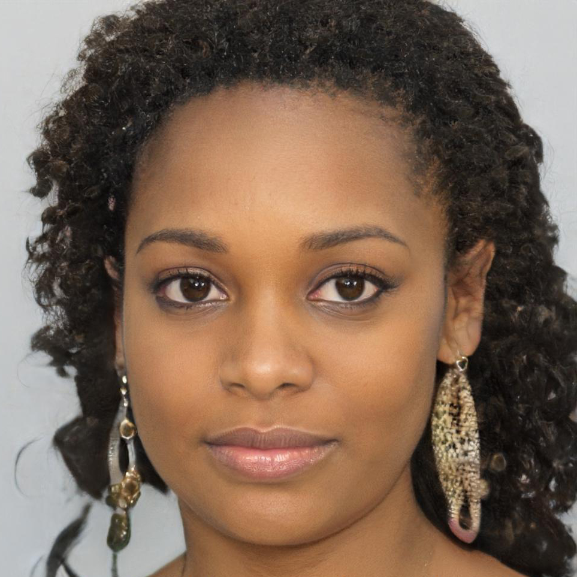

# Personas

## Introdução

Persona é uma personagem fictícia criada para representar os usuários da aplicação. Elas devem possuir características que sumarizam bem os usuários “típicos”, mas que sejam específicas para torná-las ferramentas de design e comunicação eficientes.<a id="anchor_1" href="#REF1">^1^</a> No contexto desse trabalho, elas serão utilizadas para melhor compreender como as funcionalidades do sistema interagem com as demandas dos usuários.

## Metodologia

As personas foram criadas a partir do [perfil de usuário](../analise-de-requisitos/perfil-usuario.md) elaborado. No total, o elenco é composto por quatro personas, x primaria(s), y secundaria(s) e uma anti persona. Essa quantidade foi escolhida, pois representa de maneira razoável a população de usuários do sistema.

## Elenco

As tabelas de 1 a x apresentam o elenco de personas.

<b>Tabela 1</b> - Persona Primária Maria Eduarda de Oliveira.

| 
Figura 1- Persona Primária Maria Eduarda de Oliveira.
<figure markdown>{:style="height:500px;width:500px;border-radius:5px"}<figcaption>Fonte: Elaborada por [Matheus Henrique](https://github.com/mathonaut) (2023).<a id="fnref:1" href="#fn:1">1</a></figcaption></figure> |
| ------------------------------------------------------------------------------------------------------------------------------------------------------------------------------------------------------------------------------------------------------------------------------------------------------------------------------------------------------------------------------------------------------------ |
| **Status**: Persona Primária.                                                                                                                                                                                                                                                                                                                                                                                |
| **Nome**: Maria Eduarda de Oliveira.                                                                                                                                                                                                                                                                                                                                                                         |
| **Gênero**: Feminino.                                                                                                                                                                                                                                                                                                                                                                                        |
| **Idade**: 31 anos.                                                                                                                                                                                                                                                                                                                                                                                          |
| **Profissão**: Médica Veterinária.                                                                                                                                                                                                                                                                                                                                                                           |
| **Escolaridade**: Pós-Graduação em Clínica Cirúrgica Veterinária.                                                                                                                                                                                                                                                                                                                                            |
| **Estado Civil**: Solteira.                                                                                                                                                                                                                                                                                                                                                                                  |
| **Relacionamento**: Funcionários da clínica que trabalha, amigos, familiares e o seu namorado Carlos.                                                                                                                                                                                                                                                                                                        |
| **Tarefas**: A rotina de Maria é muito organizada. Sai de casa às 09:00 horas para ir trabalhar, ficando no trabalho até às 18:00 horas. Ao voltar do trabalho, realiza por cerca de uma hora uma caminhada com seu poodle Fifo. Após essa caminhada, prepara o jantar com Carlos finalizando o dia. Eventualmente, Maria substitui o jantar com Carlos por um evento com os amigos.                         |
| **Habilidades e Experiências**: Conhecimento em cirurgia veterinária. Possui alta capacidade analítica e estabilidade emocional, é bastante comunicativa praticando nos fins de semanas yoga com seus amigos. Realiza diariamente análise de imagens de radiografias.                                                                                                                                        |
| **Objetivo**: Maria pretende se casar com seu noivo Carlos no fim do ano. Criar sua própria clínica veterinária. Ir ao menos em um show por mês.                                                                                                                                                                                                                                                             |
| **Expectativa**: Acredita que o site apresenta de forma minimalista as informações e que seja de fácil uso. Espera ainda, que possa visualizar eventos de interesse que sejam próximos de onde mora.                                                                                                                                                                                                         |
| **Requisitos**: Deseja comprar ingressos, visualizar eventos e compartilhá-los em suas redes sociais.                                                                                                                                                                                                                                                                                                        |

Fonte: [Matheus Henrique](https://github.com/mathonaut).

## Referências Bibliográficas

> <a id="REF1" href="#anchor_1">1.</a> BARBOSA, S. D. J.; SILVA, B. S. Interação Humano-Computador. Rio de Janeiro: Elsevier, 2011.

## Bibliografia

> ROCHA, Lucas Lopes. Perfil do Usuário. Repositório da disciplina de Requisitos de Software da Universidade de Brasília, 2022. Disponível em: <<https://interacao-humano-computador.github.io/2022.2-Skoob/analise-de-requisitos/personas/>>. Acesso em: 06 maio 2023.

> VAS, João Lucas. Personas. Repositório da disciplina de Requisitos de Software da Universidade de Brasília, 2022. Disponível em: <<https://interacao-humano-computador.github.io/2022.2-SimplesNacional/Tarefas/personas/>>. Acesso em: 02 maio 2023.

> MACHADO, M. et al. Personas. Repositório da disciplina de Requisitos de Software da Universidade de Brasília, 2022. Disponível em: <<https://requisitos-de-software.github.io/2022.2-Lichess/elicitacao/personas/>>. Acesso em: 03 maio 2023.

## Histórico de Versões

| Versão | Data       | Descrição                                    | Autor(es)                                        | Revisor(es)                                      |
| ------ | ---------- | -------------------------------------------- | ------------------------------------------------ | ------------------------------------------------ |
| `1.0`  | 06/05/2023 | Criação da página.                           | [Matheus Henrique](https://github.com/mathonaut) | [Rafael Ferreira](https://github.com/RafaelCLG0) |
| `1.1`  | 06/05/2023 | Adição da persona Maria Eduarda de Oliveira. | [Matheus Henrique](https://github.com/mathonaut) | [Rafael Ferreira](https://github.com/RafaelCLG0) |

[^1]: Imagem gerada através da aplicação This Person Doesn't Exist. Disponível em: [https://this-person-does-not-exist.com/pt](https://this-person-does-not-exist.com/pt). Acesso em: 06 de maio de 2023.
