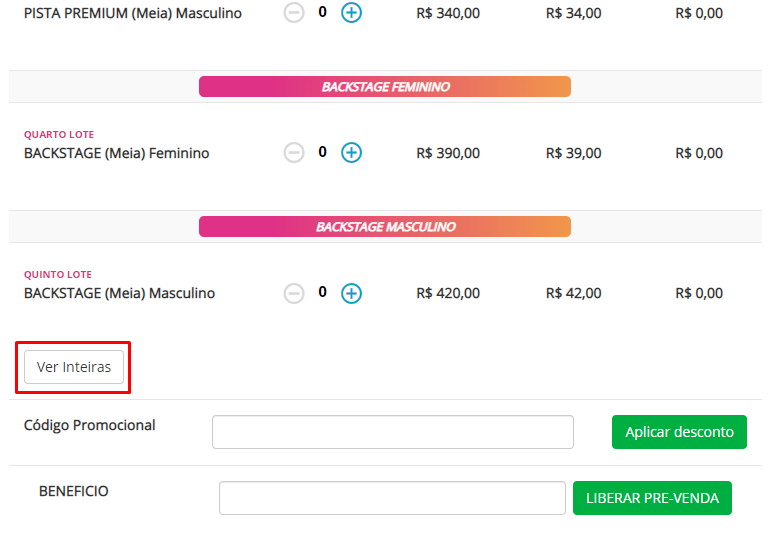
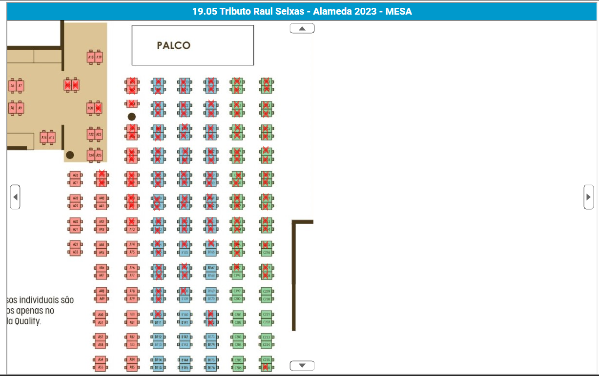
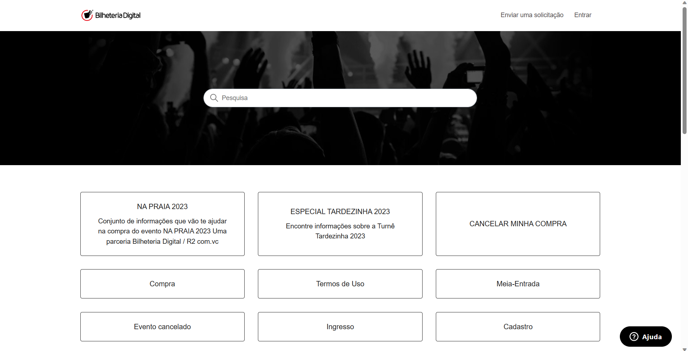
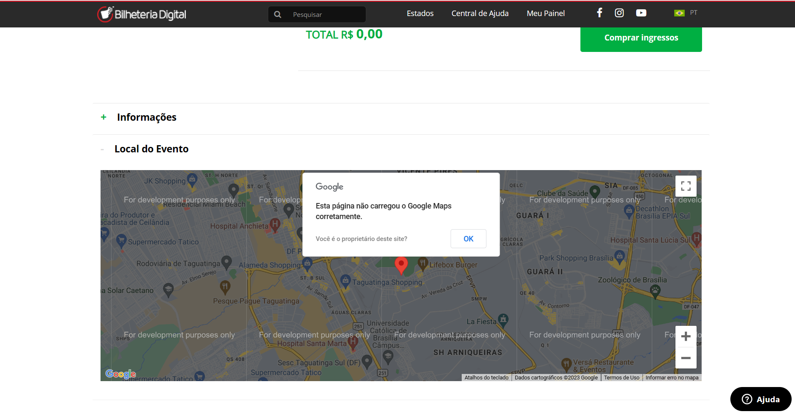
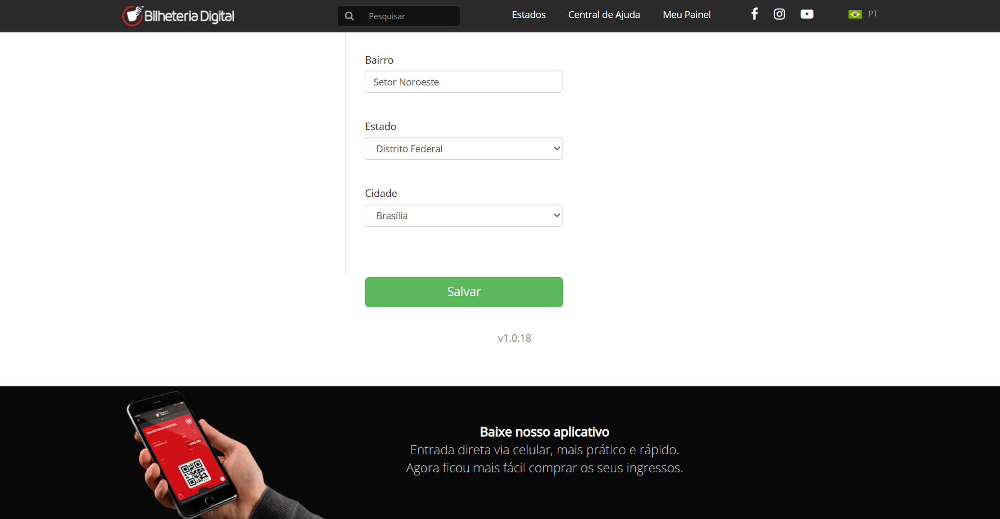
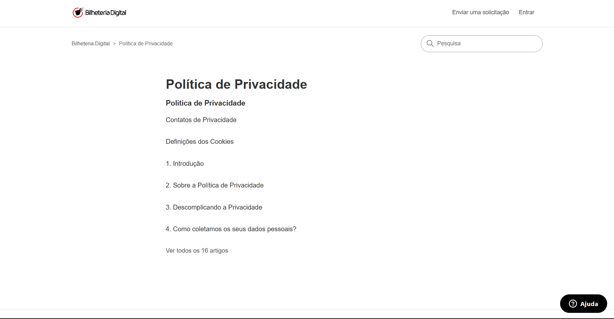
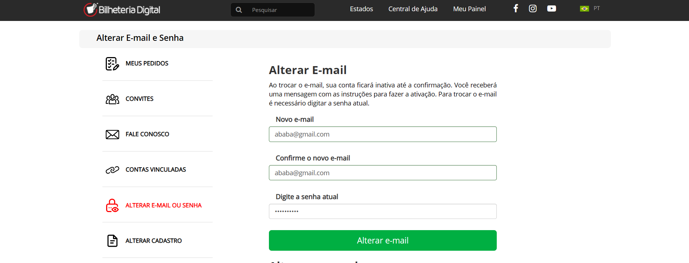
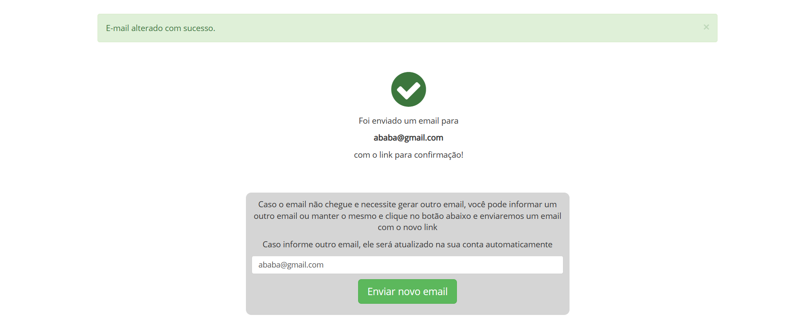

## Introdução

Para que um modelo conceitual atenda às necessidades de um determinado usuário, ou seja, tal consiga aprender de forma natural e rápida, essa estrutura deve seguir Princípios e Diretrizes Gerais. Sendo assim, o design deve facilitar: a determinação de quais ações são inexoráveis para aquele momento, para tal, utiliza-se de restrições; o esclarecimento visual de certos aspectos, o que inclui o modelo conceitual do sistema, as ações alternativas e suas consequências; a avaliação do estado corrente do sistema, que deve seguir mapeamentos naturais entre as intenções e as ações requeridas, entre as ações e o efeito resultado, e entre a informação explícita e a interpretação do estado do sistema<a id="anchor_1" href="#REF1">^1^</a>. Os integrantes responsáveis pela criação desse artefato foram: [Arthur de Melo](https://github.com/arthurmlv) e [Gabriel Campello](https://github.com/G16C).

## Metodologia

Para cada tópico, buscou-se levantar a vicissitude presente no site que mais viola o respectivo Princípio Geral, separou-se assim em suptópicos: Definição e Violação. Para o desenvolvimento da violação, foi realizada uma análise individual do site em questão por parte de cada participante visando ao entendimento e aonde poderíamos encontrar tais violações. Além disso, a análise foi feita somente na versão desktop do site.

## Correspondência com as Expectativas dos Usuários

### Definição

Neste tópico, o ponto principal é a naturalidade com a qual o usuário controla o sistema projetado. Sendo assim, necessita-se analisar as variáveis psicológicas e físicas as quais envolvem o universo daquele sistema. Portanto, deve-se certificar de que o usuário consiga determinar as seguintes relações: intenções e ações possíveis; entre ações e seus efeitos no sistema; entre o estado real do sistema e o que é percebido pela visão, audição ou tato; entre o estado percebido do sistema e as necessidades, intenções e expectativas do usuário<a id="anchor_1" href="#REF1">^1^</a>.

### Violação

Na Figura 1, é possível perceber a violação da Correspondência com a Expectativa do Usuário, dado que o filtro padrão de região é São Paulo, o qual aparece em letras grandes e destacado na cor vermelha. No entanto, o verdadeiro botão de mudar a região fica em um botão menor, localizado no header, a uma distância considerável de onde se localiza o "SÃO PAULO" escrito.

Figura 1 - Violação Correspondência

<figure markdown>{:style="height:550px;width:750px;border-radius:5px"}<figcaption>Fonte: [Bilheteria Digital](https://www.bilheteriadigital.com/).</figcaption></figure>

## Simplicidade nas Estruturas das Tarefas

### Definição

O planejamento e a resolução de problemas requisitados devem ser reduzidos a fim de reduzir a complexidade de uma determinada tarefa, dado que tal pode ser desnecessariamente complexa. Portanto, a simplificação segue quatro abordagens tecnológicas<a id="anchor_1" href="#REF1">^1^</a>:

- manutenção da essência da tarefa, mas com diversos aparatos que auxiliam na realização de tal; 
- explicitar de maneira visual o que antes era obscuro ao usuário, o que melhora o controle do usuário sobre a tarefa e o feedback recebido por ele;
- automatizar completamente ou parcialmente a tarefa;
- alterar a natureza da tarefa.

### Violação

Uma violação da Simplicidade nas Estruturas das Tarefas é claramente visível ao procurar o preço de um determinado ingresso, presente na Figura 2. Na busca, o preço não aparece, o usuário precisa abrir a página para visualizar o preço. Além disso, às vezes, somente a meia-entrada fica explícita, e o ingresso de preço inteiro só aparece ao clicar em um botão, no caso, o botão destacado em vermelho (retângulo vermelho não presente no site) na Figura 3.

Figura 2 - Violação Simplicidade 1

<figure markdown>{:style="height:550px;width:750px;border-radius:5px"}<figcaption>Fonte: [Bilheteria Digital](https://www.bilheteriadigital.com/).</figcaption></figure>

Figura 3 - Violação Simplicidade 2

<figure markdown>{:style="height:550px;width:750px;border-radius:5px"}<figcaption>Fonte: [Bilheteria Digital](https://www.bilheteriadigital.com/).</figcaption></figure>

## Equilíbrio entre Controle e Liberdade do Usuário

### Definição

A partir da ideia de que o usuário é o proprietário do computador, da interface e do ambiente de trabalho, quando o sistema é responsivo a ponto do usuário se sentir no comando de tal, o usuário aprende rapidamente e ganha um sentimento de maestria. No entanto, deve-se ressaltar a necessidade da busca por um equilíbrio, pois as restrições servem para guiar o usuário e evitar o acúmulo de informações, o que resulta em uma confusão mental para o sujeito. Portanto, o sistema deve, de maneira discreta, induzir o usuário a sentir que há somente uma única opção<a id="anchor_2" href="#REF2">^2^</a>.

### Violação

Neste tópico, o principal entrave é a liberdade do usuário, o site não permite ao usuário aprimorar sua busca de diversas formas, o único filtro aplicável é o de Estado e a busca não pode ser reorganizada pelo usuário. Por exemplo, ele não pode ordenar por data ou por preço. O padrão não muda e é sempre: por data, sendo em ordem e listando os resultados de acordo com a data mais recente, como demonstrado na Figura 4.

Figura 4 - Violação Liberdade

<figure markdown>{:style="height:550px;width:750px;border-radius:5px"}<figcaption>Fonte: [Bilheteria Digital](https://www.bilheteriadigital.com/).</figcaption></figure>

## Consistência e Padronização

### Definição

Com o intuito de facilitar o aprendizado e o uso de um sistema, recomenda-se um padrão consistente, que perdura dentro do modelo conceitual, na interface<a id="anchor_1" href="#REF1">^1^</a>. No entanto, quando tal consistência for impossibilitada pela natureza do sistema, deve-se definir mapeamentos arbitários, ou seja, padronizar<a id="anchor_2" href="#REF2">^2^</a>.

### Violação

Ao comprar um ingresso o qual permite a escolha de uma poltrona, o site, para selecionar a poltrona, abre um pop-up com o mapa. Diferente de outros diversos elementos do site, o mapa não fica centralizado na tela, ele aparece alinhado à esquerda. Além disso, pode-se visualizar na Figura 5, o mapa é mostrado em uma página completamente diferente dos demais elementos do site.

Figura 5 - Violação Consistência

<figure markdown>{:style="height:400px;width:800px;border-radius:5px"}<figcaption>Fonte: [Bilheteria Digital](https://www.bilheteriadigital.com/).</figcaption></figure>

## Promoção da Eficiência do Usuário

### Definição

O espectro predominante neste tópico é o econômico. Sendo assim, a eficiência do usuário está relacionada ao custo, dado que as pessoas custam mais do que máquinas. Além disso, ao economizar tempo e esforço do usuário, realiza-se um investimento melhor do que economizar em processamento ou armazenamento. Portanto, é necessário suprimir a ociosidade do usuário, de forma que o trabalho do usuário não seja impedido pelo sistema: os processos acontecem em um plano de fundo enquanto o usuário trabalha em outras partes<a id="anchor_2" href="#REF2">^2^</a>.

### Violação

Na aba de "Central de ajuda", o usuário ao yenatr retornar à página inicial, clicando na logo do site, é  impedido de efetuar essa operação, sendo, portanto, obrigado à utiliazar o botão de retorno do navegador como mostrado na Figura 6. Isso pode causar estranhesa ao consumidor e afetar a eficiência das operções realizadas no site. Outro problema encontrado foi durante o processo de compra. Ao descer a página de um evento podemos encontrar uma funcionalidade destinada à visualizar o local do evento. No entanto essa funcionalidade não abre corretamente no site do Google Maps, como mostrado na figura 7. 

Figura 6 - Violação Eficiência do Usuário 1

<figure markdown>{:style="height:400px;width:800px;border-radius:5px"}<figcaption>Fonte: [Bilheteria Digital](https://www.bilheteriadigital.com/).</figcaption></figure>

Figura 7 - Violação Eficiência do Usuário 2

<figure markdown>{:style="height:400px;width:800px;border-radius:5px"}<figcaption>Fonte: [Bilheteria Digital](https://www.bilheteriadigital.com/).</figcaption></figure>

## Antecipação

### Definição

Todo o tipo de informação essencial ao usuário naquele determinado momento deve ser fornecida ao usuário sem que ele precise requisitar tal ao sistema. Além disso, o software deve antecipar também situações com altas propabilidades de acontecimento, o que aumenta a responsividade do sistema<a id="anchor_3" href="#REF3">^3^</a>.

### Violação

Durante o uso do site, mesmo o usuário tendo se cadastrado e informado seu endereço, a página inicial continua com eventos do estado de São Paulo como padrão, para acessar eventos da sua região o próprio usuário deve selecionar seu estado, como mostardo nas Figuras 8 e 9.

Figura 8 - Violação Antecipacao 1

<figure markdown>{:style="height:400px;width:800px;border-radius:5px"}<figcaption>Fonte: [Bilheteria Digital](https://www.bilheteriadigital.com/).</figcaption></figure>

Figura 9 - Violação Antecipacao 2

<figure markdown>{:style="height:400px;width:800px;border-radius:5px"}<figcaption>Fonte: [Bilheteria Digital](https://www.bilheteriadigital.com/).</figcaption></figure>

## Visibilidade e Reconhecimento

### Definição

Antes que uma ação seja executada, o usuário precisa ter uma visão prévia das maneiras de como podem ser realizadas e das instruções para a sua execução. Ademais, a interface deve apresentar informações lógicas e disponíveis ao usuário naquele momento<a id="anchor_1" href="#REF1">^1^</a>.

### Violação

Na central de ajuda, na aba de "Política de Privacidade", existe um link associado ao título da página que abre informações redundantes, como mostrado na Figura 10. Além disso, o site não apresenta informações essenciais para a completude do processo de compra, como por exemplo a chave pix necessária para efetuar o pagamento, apresentado na Figura 11.

Figura 10 - Violação Visibilidade e Reconhecimento 1

<figure markdown>{:style="height:400px;width:800px;border-radius:5px"}<figcaption>Fonte: [Bilheteria Digital](https://www.bilheteriadigital.com/).</figcaption></figure>

Figura 11 - Violação Visibilidade e Reconhecimento 2

<figure markdown>{:style="height:400px;width:800px;border-radius:5px"}<figcaption>Fonte: [Bilheteria Digital](https://www.bilheteriadigital.com/).</figcaption></figure>

## Conteúdo Relavante e Expressão Adequada

### Definição

Para o tópico de Conteúdo Relavante e Expressão Adequada, destacam-se quatro máximas<a id="anchor_4" href="#REF4">^4^</a>:

- máxima da qualidade: não se deve realizar especulações ou proferir mentiras;
- máxima da quantidade: a quantidade de informação deve respeitar um limite imposto pelos objetivos da conversa;
- máxima da relação ou relevância: tudo o que for comunicado deve ter relação explícita e relevante ao tópico em questão;
- máxima de modo ou clareza: as conversas devem ser precisas e sem excesso.

### Violação

A expressão "Meu Painel", não está em acordo com a máxima da relação ou relevância. Tendo em vista que não é uma expressão comumente utilizada para apresentar as informações do usuário cadastrado, como mostrado na Figura 12.

Figura 12 - Violação Relevância e Expressão Adequada 2

<figure markdown>{:style="height:400px;width:800px;border-radius:5px"}<figcaption>Fonte: [Bilheteria Digital](https://www.bilheteriadigital.com/).</figcaption></figure>

## Projeto para Erros

### Definição

Dado que tanto o usuário quanto o sistema são passíveis de erro, o sistema deve se preparar para os potenciais erros que podem ocorrer. Sendo assim, tal preparação deve informar a ocorrência do erro ao usuário e instruir como reverter a possível perda ou ação indesejada. Além disso, ações irreversíveis devem requisitar uma confirmação persistente do usuário<a id="anchor_1" href="#REF1">^1^</a>.

### Violação

Durante o processo de alteração de email, não foi apresentada ao usuário qualquer mensagem de confirmação adicional, ou seja o usuário poderia clicar sem querer no botão de confirmação o que resulatria em email alterado sem que esse fosse o objetivo do usuário, como mostrado nas Figuras 13 e 14. 

Figura 13 - Violação Projeto para Erros 1

<figure markdown>{:style="height:400px;width:800px;border-radius:5px"}<figcaption>Fonte: [Bilheteria Digital](https://www.bilheteriadigital.com/).</figcaption></figure>

Figura 14 - Violação Projeto para Erros 2

<figure markdown>{:style="height:400px;width:800px;border-radius:5px"}<figcaption>Fonte: [Bilheteria Digital](https://www.bilheteriadigital.com/).</figcaption></figure>

## Bibliografia

> BARBOSA, S. D. J.; SILVA, B. S. Interação Humano-Computador. Rio de Janeiro: Elsevier, 2011.

## Referências Bibliográficas

> <a id="REF1" href="#anchor_1">1.</a> NORMAN, Don. The Psychology Of Everyday Things. Basic Books, New York, illustrated edition, 1988.

> <a id="REF2" href="#anchor_2">2.</a> TOGNAZZINI, Bruce. First Principles of Interaction Design (Revised & Expanded), 2014.

> <a id="REF3" href="#anchor_3">3.</a> COOPER, Alan. The Inmates Are Running the Asylum: Why High Tech Products Drive Us Crazy and How to Restore the Sanity (2nd Edition). Sams Publishing, 1999.

> <a id="REF4" href="#anchor_4">4.</a> REEVES, Byron e NASS, Clifford. The Media Equation: How People Treat Computers, Television, and New Media Like Real People and Places. Cambridge University Press/CSLI, Stanford, Calif, new edition, 1996.

## Histórico de Versão

| Versão |    Data    |                Descrição                 |                    Autor(es)                     |                 Revisor(es)                  |
| ------ | ---------- | ------------------------------------------- | ------------------------------------------------ | ------------------------------------------- |
| `1.0`  | 11/05/2023 | Documentação dos Princípios Gerais. | [Arthur de Melo](https://github.com/arthurmlv) | [Geovanna Maciel](https://github.com/manuziny) |
| `1.1`  | 18/05/2023 | Violação dos Princípios Gerais. | [Arthur de Melo](https://github.com/arthurmlv) | [Gabriel Campello](https://github.com/G16C) |
| `1.2`  | 20/05/2023 | Violação dos Princípios Gerais 2. | [Gabriel Campello](https://github.com/G16C) | [Arthur de Melo](https://github.com/arthurmlv) |

