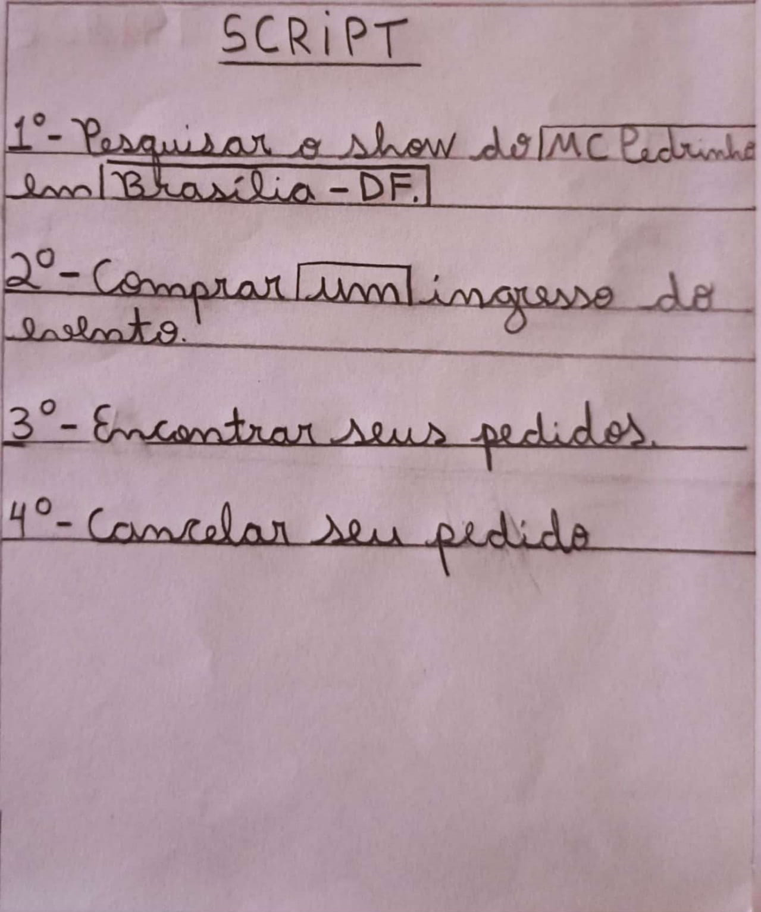

# Relato dos Resultados - Protótipo de Alta Fidelidade

## Introdução

Esse artefato tem o objetivo de documentar o relato dos resultados obtidos pela avaliação do protótipo de alta fidelidade. Portanto, serão abordados os tópicos referidos no [Planejamento do Relato dos Resultados do Protótipo de Alta Fidelidade](https://interacao-humano-computador.github.io/2023.1-BilheteriaDigital/design-avaliacao-desenvolvimento/nivel-3/planejamento-relato-paf/#metodologia).

## Objetivo e Escopo da Avaliação

A avaliação tem o objetivo de obter a opinião de usuários reais da aplicação [Bilheteria Digital](https://www.bilheteriadigital.com/) sobre a usabilidade, funcionalidade e aparência visual de um protótipo de alta fidelidade que se assemelha de forma mais precisa à versão final do produto ou serviço. Além disso, a avaliação objetiva identificar problemas no design da interface e conformidade com padrões. As seguintes perguntas apresentam formas de verificar se os referidos objetivos foram alcançados:

- A interface segue o padrão do sistema operacional?
- Foi possível testar a interação e a facilidade de uso do protótipo para identificar problemas de usabilidade?
- Foi possível avaliar a aparência e o estilo visual do protótipo, garantindo que ele atenda às expectativas e necessidades dos usuários, transmita a identidade da marca e seja estéticamente agradável?
- Foi possível verificar se todas as funcionalidades planejadas estão presentes e funcionam corretamente?
- Foi possível obter opiniões, percepções e sugestões dos usuários em relação ao protótipo?
- Foi possível identificar quaisquer problemas, erros ou áreas que precisam de ajustes no protótipo antes da implementação final?

## Método de Avaliação

A metodologia utilizada foi o teste de usabilidade, no qual visa avaliar a usabilidade de um sistema interativo a partir de experiências de uso reais dos seus usuários-alvo (Rubin, 1994<a id="anchor2" href="#REF2">2</a>; Rubin e Chisnell, 2008<a id="anchor3" href="#REF3">3</a>). Nesses testes, um grupo de usuários realiza um conjunto de tarefas usando o sistema num ambiente controlado, sendo registrado as experiências de uso, dados sobre o desempenho dos participantes na realização das tarefas propostas e suas opiniões/sentimentos sobre essas experiências. Vale ressaltar que esse método foi escolhido, pois permite a identificação de problemas reais enfrentados pelos usuários do sistema e não apenas problemas previstos pelos desenvolvedores. A tabela 1 apresenta o cronograma executado do teste de usabilidade, com o avaliador mediador, o usuário, a data, o horário de início e de fim e, por fim, o local. No entanto, vale ressaltar que todos os membros do grupo participaram do teste de usabilidade.

**Tabela 1** - Cronograma Executado.

| Avaliador                                    | Usuário                                              | Data       | Início-Fim  | Local         |
| -------------------------------------------- | ---------------------------------------------------- | ---------- | ----------- | ------------- |
| [Douglas Alves](https://github.com/dougalvs) | Josué Teixeira  | 21/06/2023 | 12:40-12:47 | FGA - Sala I2 |
| [Douglas Alves](https://github.com/dougalvs) | Abdul Hannan    | 21/06/2023 | 12:50-12:57 | FGA - Sala I2 |
| [Douglas Alves](https://github.com/dougalvs) | Karen Júlia     | 21/06/2023 | 13:00-13:07 | FGA - Sala I2 |
| [Douglas Alves](https://github.com/dougalvs) | Sidney Fernando | 21/06/2023 | 13:10-13:17 | FGA - Sala I2 |

Fonte: [Gabriel Campello](https://github.com/G16C) e [Matheus Henrique](https://github.com/mathonaut).

### Local

Os testes ocorreram de forma presencial na sala I2 do campus FGA da Universidade de Brasília (UnB). O ambiente foi controlado, sendo permitidos estarem em sala somente os integrantes do grupo responsável por alguma atividade técnica e o usuário que realizaria o teste/entrevista.

### Ferramentas

As ferramentas utilizadas foram as seguintes:

- Um notebook com webcam e microfone;
- Um smartphone utilizado para gravação em vídeo dos testes;
- Um smartphone utilizado para capturar áudios;
- Um papel contem o script a ser seguido pelos usuarios;
- Um papel contendo as tarefas e perguntas a serem respondidas.

### Tarefas

As tarefas realizadas pelos os usuarios foram as seguintes:

- Buscar um evento;
- Comprar um ingresso;
- Visualizar meus pedidos;
- Cancelar Compra.

### Descrição dos Testes

Antes de se iniciar os testes em si foi apresentado ao usuário um _script_ contendo as ações que o entrevistado deveria realizar dentro do sistema. O entrevistado também foi orientado a reproduzir as ações que estava executando em voz alta. A figura 1 apresenta o _script_ seguido pelos usuários.

**Figura 1** - _Script_ seguido pelos usuários.

{ width="500" }

_Fonte: [Matheus Henrique](https://github.com/mathonaut), 2023._

O teste teve início com a apresentação ao usuário o termo de consentimento para que pudesse ser confirmado a sua participação e autorizado o prosseguimento do teste. Logo após, foi autorizado que o usuário realizasse as tarefas. A primeira tarefa realizada foi a de busca de um show do Mc Pedrinho que seria realizado em Brasília, DF. Em seguida foi solicitado que se realizasse a compra de um único ingresso e que se encontrasse esse ingresso nos pedidos realizados. Finalizando, o usuário foi instruído a cancelar essa compra.

### Protótipo de Alta Fidelidade

O Protótipo de Alta Fidelidade utilizado nos testes é apresentado a seguir. É importante salientar que o protótipo apresentado pode não ser o exato modelo utilizado nos testes, pois o protótipo sofre alterações e correções com o tempo.

<iframe style="border: 1px solid rgba(0, 0, 0, 0.1);" width="800" height="450" src="https://www.figma.com/embed?embed_host=share&url=https%3A%2F%2Fwww.figma.com%2Fproto%2FCSsRpoXBR0BWWojN1ZrDn0%2FProt%25C3%25B3tipo-de-Alta-FIdelidade%3Fpage-id%3D0%253A1%26type%3Ddesign%26node-id%3D11-1429%26viewport%3D842%252C836%252C0.06%26scaling%3Dscale-down%26starting-point-node-id%3D11%253A1429%26show-proto-sidebar%3D1%26mode%3Ddesign" allowfullscreen></iframe>

### Teste Piloto

O vídeo 1 a seguir mostra o teste piloto realizado antes dos testes.

[Vídeo 1 - Teste Piloto](https://www.youtube.com/embed/kPtOfcHIqK0)

<iframe width="560" height="315" src="https://www.youtube.com/embed/kPtOfcHIqK0"></iframe>

_Fonte: [Douglas Alves](https://github.com/dougalvs) e [Matheus Henrique](https://github.com/mathonaut), 2023.
_

## Seleção dos Participantes

O número de participantes foi de 7 pessoas, sendo dois avaliadores, dois coordenadores, um captador de áudio, um cinegrafista e quatro usuários. A escolha desse número de usuários foi baseada na recomendação de Krug (2010, p. 157)<a id="anchor1" href="#REF1">1</a> para testes de usabilidade. Além disso, os usuários foram escolhidos levando em conta as características definidas no [perfil de usuário](../../../analise-de-requisitos/perfil-usuario), sendo elas: idade entre 20 e 35 anos, experiência e afinidade com tecnologia e tarefas primárias de compra e consulta. A tabela 1 apresenta os participantes da avaliação e suas respectivas funções.

**Tabela 2** - Participantes da Avaliação e Suas Funções.

| Participantes                                        | Função                   |
| ---------------------------------------------------- | ------------------------ |
| [Arthur de Melo](https://github.com/arthurmlv)       | Captura de Áudio         |
| [Douglas Alves](https://github.com/dougalvs)         | Avaliador (Moderador)    |
| [Gabriel Campello](https://github.com/G16C)          | Coordenação da Equipe    |
| [Geovanna Maciel](https://github.com/manuziny)       | Coordenação dos Usuários |
| [Matheus Henrique](https://github.com/mathonaut)     | Avaliador (Anotações)    |
| [Rafael Ferreira](https://github.com/RafaelCLG0)     | Cinegrafista             |
| Abdul Hannan    | Usuário (Testador)       |
| Josué Teixeira  | Usuário (Testador)       |
| Karen Júlia     | Usuário (Testador)       |
| Sidney Fernando | Usuário (Testador)       |

_Fonte: [Gabriel Campello](https://github.com/G16C) e [Matheus Henrique](https://github.com/mathonaut), 2023._

## Problemas e Dificuldades Encontradas

A princípio, os testes ocorreram sem muitos problemas. Foi encontrado três problemas, um em uma funcionalidade e os outros dois ligados a interface da aplicação.

Em relação ao problema de funcionalidade, ele ocorreu na página inicial no momento em que o usuário tentava realizar a pesquisa por localidade. A referida função estava implementada apenas em uma página específica e não em toda a aplicação. A tabela 3 a seguir resume a avaliação do problema.

**Tabela 3** - Problema 1: Função de Pesquisa por Localidade.

| Item de Análise                      | Descrição                                                        |
| ------------------------------------ | ---------------------------------------------------------------- |
| Local:                               | Tela inicial da aplicação.                                       |
| Contexto:                            | O usuário entra na aplicação com a intenção de procurar um show. |
| Causa:                               | Botão com a função não apresentou a ação esperada.               |
| Ação Realizada pelo Usuário:         | Clique no botão "Localização".                                   |
| Resposta do Sistema Esperada:        | Apresentação do menu com uma lista de localidades.               |
| Resposta do Aprsentada pelo Sistema: | Não foi apresentado o menu com uma lista de localidades.         |
| Fatores de Usabilidade Prejudicados: | Eficácia, Eficiência e Utilidade.                                |

_Fonte: [Matheus Henrique](https://github.com/mathonaut), 2023._

Sobre o problema de interface, os usuários Josué e Karen acharam o botão de visualizar detalhes do pedido muito pequeno. Todos os usuários notaram também, que a cor e o tamanho do botão de cancelar pedido eram pouco chamativas. As tabelas 4 e 5 a seguir apresenta as avaliações dos problemas.

**Tabela 4** - Problema 2: Botão Visualizar Detalhes.

| Item de Análise                      | Descrição                                                         |
| ------------------------------------ | ----------------------------------------------------------------- |
| Local:                               | Página de meus pedidos.                                           |
| Contexto:                            | O usuário entra na página com a intenção de visualizar um pedido. |
| Causa:                               | O botão apresenta um tamanho pequeno.                             |
| Ação Realizada pelo Usuário:         | Visualizou o botão na página.                                     |
| Resposta do Sistema Esperada:        | Apresentação o botão com tamanho adequado.                        |
| Resposta do Aprsentada pelo Sistema: | O botão apresentado possui um tamanho não desejado.               |
| Fatores de Usabilidade Prejudicados: | Eficácia, Eficiência e Segurança.                                 |

_Fonte: [Matheus Henrique](https://github.com/mathonaut), 2023._

**Tabela 5** - Problema 3: Botão Cancelar.

| Item de Análise                      | Descrição                                                                  |
| ------------------------------------ | -------------------------------------------------------------------------- |
| Local:                               | Página de meus pedidos.                                                    |
| Contexto:                            | O usuário entra na página de pedidos com a intenção de cancelar um pedido. |
| Causa:                               | O botão possui um design pouco chamativo.                                  |
| Ação Realizada pelo Usuário:         | Visualizou o botão na página.                                              |
| Resposta do Sistema Esperada:        | Apresentação de forma chamativa o botão próximo ao pedido.                 |
| Resposta do Aprsentada pelo Sistema: | O botão não possui cor vermelha.                                           |
| Fatores de Usabilidade Prejudicados: | Eficácia, Eficiência e Segurança.                                          |

_Fonte: [Matheus Henrique](https://github.com/mathonaut), 2023._

## Sugestões de Melhoria

Tendo em vista os problemas elicitados no tópico anterior, ficam as seguintes sugestões de correção:

- Incluir a funcionalidade de pesquisa por localidade em todas as páginas onde o recurso se mostra necessário;
- Alterar o design do botão de cancelamento, deixando-o mais chamativo a fim de possibilitar uma rápida identificação pelo usuário;
- Alterar o design do botão de visualizar detalhes, deixando-o mais chamativo.

## Feedback dos Usuários

### Teste 1 - Josué Teixeira

O usuário não encontrou muitas dificuldades na realização das tarefas. A tarefa de busca foi realizada com apenas 1 clique e 1 scroll down da página, a de compra de ingresso com 5 cliques, a de visualizar pedido com 3 cliques e a de cancelar pedido com 3 cliques.

Em relação aos entraves encontrados, se observou uma dificuldade em visualizar o botão de cancelamento de pedido e na finalização da compra de ingresso com o sistema obrigando o usuário a clicar na forma de pagamento antes de aceitar os termos de serviços.

Somado a isso, foi observado uma atitude confiante na realização das tarefas de busca e compra de ingresso. Porém, na tarefa de cancelamento de pedido ocorreu alguns entraves, com o usuário mostrando um claro desconforto ao tentar cancelar o pedido, em certo momento até mesmo perdido clicando em alguns elementos da interface na intenção de acessar a página de cancelamento.

### Teste 2 - Abdul Hannan

O usuário não encontrou muitas dificuldades na realização das tarefas. A tarefa de busca ocorreu com 1 clique e um scroll down da página, a de compra com 5 cliques, a de visualizar pedido com 3 cliques e a de cancelamento com 3 cliques.

Outrossim, o design dos botões de cancelamento e visualização de pedido se demonstraram insuficiente em fornecer ao usuário uma eficiência na realização das tarefas. Além disso, foi observado novamente uma dificuldade ao confirmar a compra sem uma indicação clara sobre o que deve ser feito para se finalizar.

Somado a isso, não foi observado uma mudança significativa nas expressões faciais sendo elas de demonstração de confiança nas ações sendo realizadas.

### Teste 3 - Karen Júlia

O usuário encontrou certa dificuldade na realização das tarefas. A tarefa de busca ocorreu com 1 clique e um scroll down da página, a de compra com 5 cliques, a de visualizar pedido com 3 cliques e a de cancelamento com 3 cliques.

Foi observado que a funcionalidade de busca por localidade não apresentava o comportamento esperado. Além disso, novamente o botões de cancelamento não é chamativo e a tela de confirmação de busca não demonstra claramente quais os passos que devem ser realizados para a conclusão da compra.

Somado a isso, foi notada uma mudança significativa nas expressões faciais, alternando entre uma atitude de confiança nas ações realizadas a demonstração de desorientação.

### Teste 4 - Sidney Fernando

O usuário não encontrou muitas dificuldades na realização das tarefas. A tarefa de busca ocorreu com dois scroll down da página e 3 cliques, a de compra com 6 cliques, a de visualizar pedido com 3 cliques e a de cancelamento com 3 cliques.

Foi notado, novamente, que o design dos botões de cancelamento não é chamativo.

Somado a isso, não foi observado uma mudança significativa nas expressões faciais sendo elas de demonstração de confiança nas ações sendo realizadas.

## Análise e Interpretação dos Usuários

Analisando os comportamentos dos usuários, percebemos que a maioria possui um nível de produtividade parecido, sendo que tarefas foram concluídas com quantidades de cliques similares. É possível notar também que há um problema crítico em relação ao botão de cancelamento, pois todos os usuários reclamaram do design pouco chamativo dele e na tela de confirmação de compra que não possui uma clareza no que está sendo realizado.

Contextualizando com as perguntas-objetivos, podemos respondê-las da seguinte maneira:

- A interface segue o padrão do sistema operacional?

Sim, não houve reclamações referente a isso.

- Foi possível testar a interação e a facilidade de uso do protótipo para identificar problemas de usabilidade?

Sim, foi possível identificar problemas de ao atingir as metas de usabilidade propostos para o projeto.

- Foi possível avaliar a aparência e o estilo visual do protótipo, garantindo que ele atenda às expectativas e necessidades dos usuários, transmita a identidade da marca e seja estéticamente agradável?

Sim, os usuários demonstraram seus pontos de vista dissonantes da equipe em relação a aparência dos botões de cancelar e visualizar pedidos.

- Foi possível verificar se todas as funcionalidades planejadas estão presentes e funcionam corretamente?

Sim, foi identificado que uma das funcionalidades previstas ainda não está totalmente implementada.

- Foi possível obter opiniões, percepções e sugestões dos usuários em relação ao protótipo?

Sim, os usuários apresentaram opiniões que serviram de objetivos para o reprojeto.

- Foi possível identificar quaisquer problemas, erros ou áreas que precisam de ajustes no protótipo antes da implementação final?

Sim, foi observado problemas que deverão ser corrigidos no reprojeto.

## Sumário dos Principais Resultados

Desse modo, em relação às metas de usabilidade priorizadas é perceptível que o sistema consegue fornecer um boa eficiência aos usuários em determinadas situações, sendo que a maioria das tarefas foram realizadas com menos de 5 cliques. Mas, ainda há problemas em relação aos elementos de interações na interface.

Em relação a segurança, o sistema ainda não fornece uma boa segurança aos usuário principalmente na tela de confirmação de compra, não é mostrado claramente os passos que devem ser feitos para se concluir uma compra e falta informação sobre taxas, porém houve uma melhora com o usuário tendo que confirmar suas intenções ao realizar ações críticas.

Na utilidade ocorreu melhorias, funcionalidades que auxiliam os usuários na realização das tarefas foram adicionadas como a busca por localidade, permitindo concluir que essa meta foi completamente atingida. Os vídeos de 2 a 5 apresentam os testes realizados.

[Vídeo 2 - Teste 1: Josué Teixeira](https://www.youtube.com/embed/i05UgWL16uc)

<iframe width="560" height="315" src="https://www.youtube.com/embed/i05UgWL16uc"></iframe>

_Fonte: [Douglas Alves](https://github.com/dougalvs) e [Matheus Henrique](https://github.com/mathonaut), 2023.
_

[Vídeo 3 - Teste 2: Abdul Hannan](https://www.youtube.com/embed/TMVRLgYxTjM)

<iframe width="560" height="315" src="https://www.youtube.com/embed/TMVRLgYxTjM"></iframe>

_Fonte: [Douglas Alves](https://github.com/dougalvs) e [Matheus Henrique](https://github.com/mathonaut), 2023.
_

[Vídeo 4 - Teste 3: Karen Júlia](https://www.youtube.com/embed/KsTOdRT_c_M)

<iframe width="560" height="315" src="https://www.youtube.com/embed/KsTOdRT_c_M"></iframe>

_Fonte: [Douglas Alves](https://github.com/dougalvs) e [Matheus Henrique](https://github.com/mathonaut), 2023.
_

[Vídeo 5 - Teste 4: Sidney Fernando](https://www.youtube.com/embed/KORZWJaFPm4)

<iframe width="560" height="315" src="https://www.youtube.com/embed/KORZWJaFPm4"></iframe>

_Fonte: [Douglas Alves](https://github.com/dougalvs) e [Matheus Henrique](https://github.com/mathonaut), 2023.
_

## Planejamento do Reprojeto

Para o reprojeto, as correções devem ser realizadas seguindo a lista de sugestão de correção apresentada anteriormente. O responsável por cada correção deve submetê-las para o time no intuito de se revisar as correções feitas, checando se elas são suficientes e se foi introduzido novos erros ou não. A tabela 6 a seguir apresenta o cronograma do reprojeto.

**Tabela 6** - Cronograma de Reprojeto.

| Data de Correção | Descrição                                                                                                    |               Responsável(eis)               |                   Revisor(es)                    |      Status      |
| ---------------- | :----------------------------------------------------------------------------------------------------------- | :------------------------------------------: | :----------------------------------------------: | :--------------: |
| 21/26/2023       | Incluir a funcionalidade de pesquisa por localidade em todas as páginas onde o recurso se mostra necessário. | [Douglas Alves](https://github.com/dougalvs) |  [Geovanna Maciel](https://github.com/manuziny)  | :material-check: |
| 25/06/2023       | Alterar o design do botão de cancelamento.                                                                   | [Douglas Alves](https://github.com/dougalvs) |  [Geovanna Maciel](https://github.com/manuziny)  | :material-check: |
| 25/06/2023       | Alterar o design do botão de visualizar detalhes.                                                            | [Douglas Alves](https://github.com/dougalvs) | [Matheus Henrique](https://github.com/mathonaut) | :material-check: |

_Fonte: [Arthur de Melo](https://github.com/arthurmlv) e [Matheus Henrique](https://github.com/mathonaut), 2023._

## Referências Bibliográficas

> <a id="REF1" href="#anchor1">1.</a> KRUG, Steve. Don’t Make Me Think, Revisited. New Riders, 2014.

> <a id="REF2" href="#anchor2">2.</a> RUBIN, J. **Handbook of Usability Testing.** New York: John Wiley & Sons, 1994.

> <a id="REF3" href="#anchor3">3.</a> RUBIN, J.; CHINSNELL, D. **Handbook of Usability Testing: How to Plan, Design, and Conduct Effective Tests, 2ed.** Indianapolis: Wiley Publishing, Inc., 2008.

## Histórico de Versões

| Versão  | Data       | Descrição                                                                                                                                      | Autor(es)                                        | Revisor(es)                                      |
| ------- | ---------- | ---------------------------------------------------------------------------------------------------------------------------------------------- | ------------------------------------------------ | ------------------------------------------------ |
| `1.0`   | 23/06/2023 | Criação da página.                                                                                                                             | [Gabriel Campello](https://github.com/G16C)      | [Matheus Henrique](https://github.com/mathonaut) |
| `1.1`   | 23/06/2023 | Refatoração do documento.                                                                                                                      | [Matheus Henrique](https://github.com/mathonaut) | [Gabriel Campello](https://github.com/G16C)      |
| `1.1.1` | 23/06/2023 | Refatoração do tópico Objetivo e Escopo da Avaliação.                                                                                          | [Matheus Henrique](https://github.com/mathonaut) | [Gabriel Campello](https://github.com/G16C)      |
| `1.1.2` | 23/06/2023 | Refatoração do tópico Método de Avaliação.                                                                                                     | [Matheus Henrique](https://github.com/mathonaut) | [Gabriel Campello](https://github.com/G16C)      |
| `1.1.2` | 23/06/2023 | Refatoração do tópico Seleção dos Participantes.                                                                                               | [Matheus Henrique](https://github.com/mathonaut) | [Gabriel Campello](https://github.com/G16C)      |
| `1.2`   | 24/06/2023 | Adição do tópico Problemas e Dificuldades encontradas.                                                                                         | [Matheus Henrique](https://github.com/mathonaut) | [Gabriel Campello](https://github.com/G16C)      |
| `1.3`   | 24/06/2023 | Adição do tópico Sugestões de Melhoria.                                                                                                        | [Matheus Henrique](https://github.com/mathonaut) | [Gabriel Campello](https://github.com/G16C)      |
| `1.4`   | 24/06/2023 | Adição dos tópicos Feedback dos Usuários, Análise e Interpretação dos Usuários, Sumário dos Principais Resultados e Planejamento do Reprojeto. | [Matheus Henrique](https://github.com/mathonaut) | [Arthur de Melo](https://github.com/arthurmlv)   |
| `1.5`   | 25/06/2023 | Atualização do cronograma de rerprojeto.                                                                                                       | [Matheus Henrique](https://github.com/mathonaut) | [Arthur de Melo](https://github.com/arthurmlv)   |
| `1.6`   | 25/06/2023 | Ajustes no texto de sumário dos dados e correções ortográficas.                                                                                | [Matheus Henrique](https://github.com/mathonaut) | [Douglas Alves](https://github.com/dougalvs)     |
| `1.7`   | 29/06/2023 | Padronização, ajustes e conclusão dos objetivos.                                                                                               | [Matheus Henrique](https://github.com/mathonaut) | [Douglas Alves](https://github.com/dougalvs)     |
