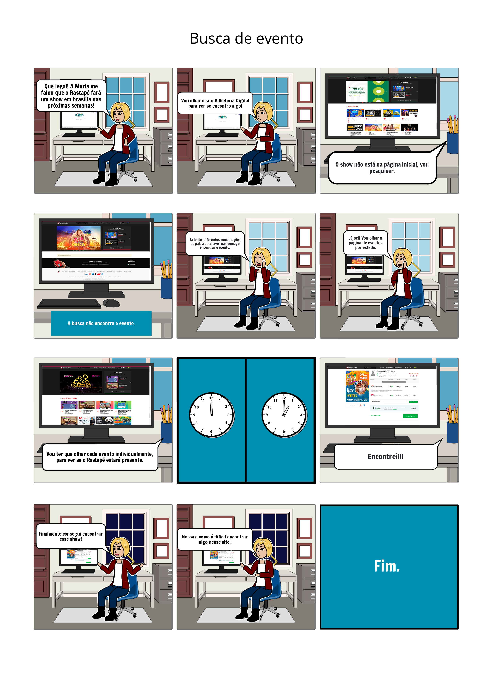

# Storybaords

## Introdução

O storyboard é um exemplo de protótipo de baixa fidelidade, muito útil devido sua simplicidade, baixo custo e rápida produção. Isso significa que podem ser rapidamente alterados. São geralmente utilizados em conjunto com cenários. <a id="anchor_1" href="#REF1">^1^</a> Ao utilizar storyboards em conjunto com cenários ou roteiros, é possível visualizar e planejar a sequência de eventos, a composição das cenas, a posição dos personagens, a movimentação da câmera e outros elementos visuais importantes. Isso ajuda a identificar possíveis problemas narrativos, ajustar a dinâmica da história e prever como ela será apresentada ao público. O storyboard consiste em uma série de ilustrações sequenciais que representam os principais momentos, ações e composições visuais de uma cena ou de todo o enredo. Cada quadro do storyboard retrata uma cena específica, acompanhada por uma descrição escrita ou diálogos relacionados. No caso de um sistema baseado em GUI. Esse modelo de artefato deve conter os seguintes elementos:

- As pessoas envolvidas;
- Ambiente/contexto;
- Tarefas;
- Passos envolvidos;
- A motivação para usar a sistema;
- O que as pessoas precisam fazer para completar a tarefa;
- A satisfação da pessoa ao completar a tarefa, no final do storyboard.

Os protótipos foram desenvolvidos com base nas tarefas definidas nos cenários.

## Tarefa 4: Cancelar compra de um ingresso

Na figura 4, podemos ver um cenário em que por algum motivo o usuário teve que cancelar a compra efetuada.

<b>Figura 4</b> - Cancelar compra de um ingresso

<figure markdown><figcaption>Fonte: [Gabriel Campello](https://github.com/G16C) (2023).</figcaption></figure>

## Tarefa 5: Buscar Evento

Na figura 5, é apresentada um storyboard sobre a busca de um show no site.

**Figura 5** - Buscar de um Evento

<figure markdown>
<figcaption>Fonte: [Matheus Henrique](https://github.com/mathonaut) (2023).</figcaption>
</figure>

## Tarefa 6: Visualizar meus pedidos

Na figura 6, é apresentada um storyboard sobre a visualização dos pedidos do usuário no site.

**Figura 6** - Storyboard visualizar meus pedidos

<figure markdown> 

<figcaption>Fonte: [Douglas Alves](https://github.com/dougAlvs) (2023).</figcaption>
</figure>

## Referências Bibliográficas

> <a id="REF1" href="#anchor_1">1.</a> PREECE, Jennifer, SHARP, Helen, ROGERS, Yvonne. Interaction Design: beyond human-computer interaction. John Wiley & Sons, 2015.

## Histórico de Versão

| Versão | Data       | Descrição                                                         | Autor(es)                                        | Revisor(es)                                    |
| ------ | ---------- | ----------------------------------------------------------------- | ------------------------------------------------ | ---------------------------------------------- |
| `1.0`  | 18/05/2023 | Criação da página de storyboards, criação do primeiro storyboard. | [Gabriel Campello](https://github.com/G16C)      | [Arthur de Melo](https://github.com/arthurmlv) |
| `1.1`  | 20/05/2023 | Adição do storyboard de Busca de Evento.                          | [Matheus Henrique](https://github.com/mathonaut) | [Arthur de Melo](https://github.com/arthurmlv) |
