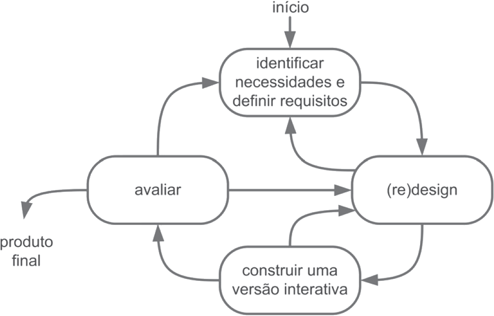

# Processo de Design

## Introdução

&emsp;&emsp;Antes de falarmos sobre o processo de design é útil definir o que é design. Segundo Barbosa e Silva (2011, p.93), podemos definir design como um processo que possui três atividades básicas, são elas: análise da situação atual (identificação de um problema), síntese de uma intervenção e avaliação da nova situação (da intervenção).

&emsp;&emsp;Os processos de design, portanto, são técnicas que permitem que as atividades elucidadas anteriormente sejam realizadas de forma sistemática e interativa com o objetivo de desenvolver soluções que atendam às necessidades dos usuários. Dentre as diversas técnicas podemos citar quatro principais, sendo elas: ciclo de vida simples, ciclo de vida em estrela, engenharia de usabilidade de Nielsen e engenharia de usabilidade de Mayhew.

&emsp;&emsp;Nesse documento, discutiremos os quatros principais processos de design e como eles podem serem aplicados para propor intervenções capazes de resolver problemas.

## Modelos

### Ciclo de Vida Simples

&emsp;&emsp;Proposto por Preece, Sharp e Rogers (Preece et al., 2002; Sharp et al. 2007). Esse modelo se concentra em duas atividades: design (ou redesign) e na construção de uma versão interativa.

&emsp;&emsp;No design ou redesign, o designer busca alternativas de design a fim de encontrar uma solução adequada às necessidades e aos requisitos definidos na atividade de análise (Simone e Silva, 2011). Os resultados dessa atividade são apresentados em formas de descrições textuais ou esboços dos modelos e da interação usuário-sistema. O designer, também constroí versões interativas das soluções propostas, demonstrando de maneira clara como as interfaces ou as interações funcionam (Simone e Silva, 2011).

&emsp;&emsp;As interações entre as atividades ocorrem quantas vezes forem necessárias. Essas atividades estão sumarizadas na figura 1.

<figure markdown>

<b>Figura 1</b> - Atividades do Modelo de Ciclo de Vida Simples

{width: 300}
<figcaption>Fonte: Barbosa e Silva, 2011</figcaption>
</figure>

## Histórico de Versão

| Versão |    Data    |                Descrição                 |                    Autor(es)                     |                 Revisor(es)                  |
| :----: | :--------: | :--------------------------------------: | :----------------------------------------------: | :------------------------------------------: |
| `1.0`  | 22/04/2023 | Criação da página de Processo de Design. | [Matheus Henrique](https://github.com/mathonaut) | [Douglas Alves](https://github.com/dougAlvs) |
